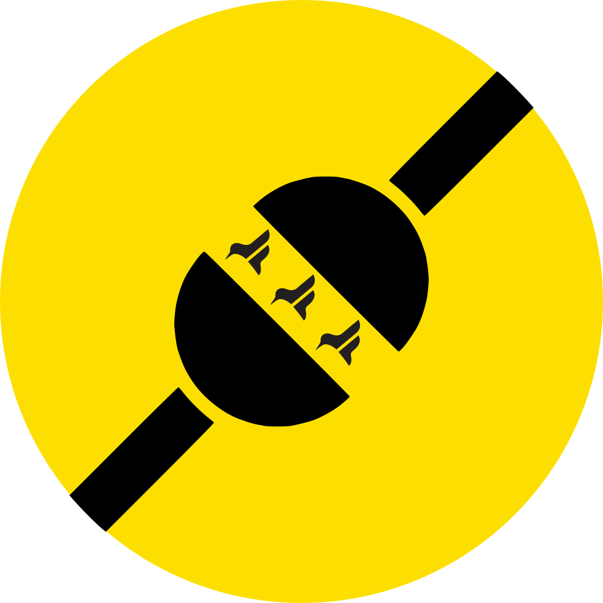
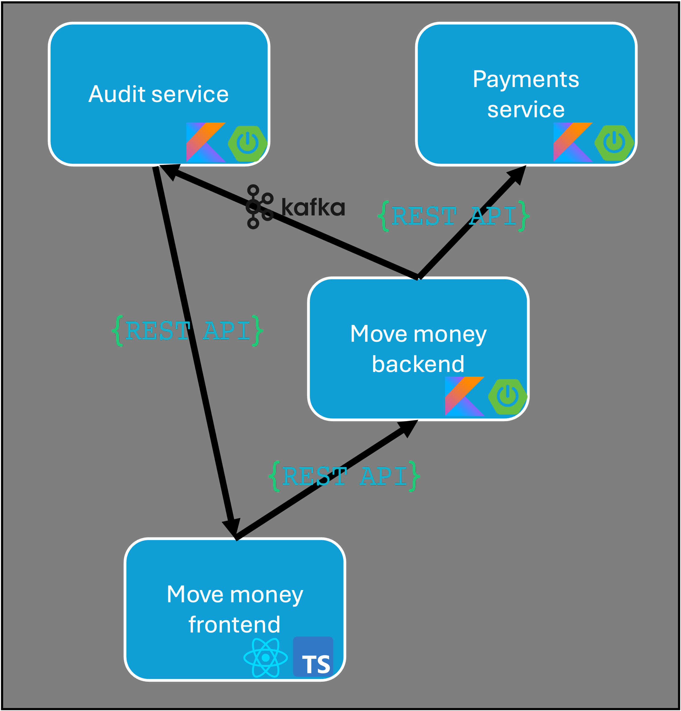
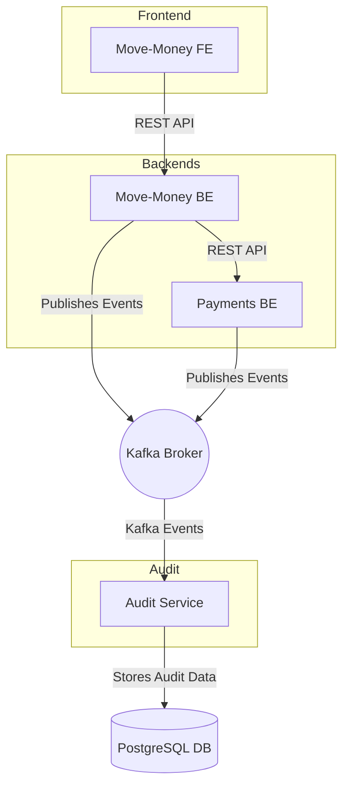

<div align="center">
<h1>
  <br>
  <a href="https://github.com/flock-community/wirespec-showcase"></a>
  <br>
    Wirespec showcase
  <br>
</h1>
The goal of this showcase project is to demonstrate the **benefits of using Wirespec** in a semi-realistic scenario.
</div>


Wirespec showcase is all about showcasing interaction between services over network boundaries. We model the interaction between **4 services** using Wirespec:

- **Frontend**: 🚀 A small application, **Move-Money FE**, that allows a user to visualize transactions and transfer
  money to others.
- **Backend 1**: 🔧 The **Move-Money BE** application, which handles incoming requests from the frontend but delegates
  transaction processing.
- **Backend 2**: 💳 The **Payments BE** application, responsible for performing all transactions.
- **Audit Service**: 📊 Listens to Kafka events to track everything that happens.

<div align="center">

</div>


---

## Getting Started 🛠️

To get started, ensure the following tools are installed:

### Minimum Requirements

- 🐳 **Docker** and **Docker Compose** (tested with Docker v27)

### Recommended Setup

- 🐳 **Docker**
- 🔨 **Maven 3** (exact version specified in [.mvnw properties](./.mvn/wrapper/maven-wrapper.properties))
- ☕ **Java 21** (exact version in [.sdkmanrc](./.sdkmanrc))
- 💻 **IntelliJ IDEA** (or your preferred IDE)
  - Plugins:
    - [Wirespec JetBrains Plugin](https://plugins.jetbrains.com/plugin/20500-wirespec)
    - [Wirespec VSCode Plugin](https://marketplace.visualstudio.com/items?itemName=Wirespec.wirespec-vscode-plugin)
- 📦 **Node.js** (exact version in [.nvmrc](./packages/frontend/.nvmrc))

### Start the showcase

Run the following command to bring up the required services:

```sh
docker compose up --build -d
```

Which should result in 9 services starting in total, including a postgres db, kafka ecosystem, 3 spring services and a
frontend app.

```
[+] Running 9/9
 ✔ Network wirespec-showcase_default                 Created                                                                                                                                          0.0s 
 ✔ Container wirespec-showcase-zookeeper-1           Healthy                                                                                                                                         14.8s 
 ✔ Container wirespec-showcase-postgresql-1          Healthy                                                                                                                                         20.1s 
 ✔ Container wirespec-showcase-kafka-1               Healthy                                                                                                                                         19.4s 
 ✔ Container wirespec-showcase-schema-registry-1     Healthy                                                                                                                                         29.9s 
 ✔ Container wirespec-showcase-move-money-service-1  Healthy                                                                                                                                         59.5s 
 ✔ Container wirespec-showcase-audit-service-1       Started                                                                                                                                         30.0s 
 ✔ Container wirespec-showcase-payments-service-1    Started                                                                                                                                         30.1s 
 ✔ Container wirespec-showcase-frontend-1            Started                                                                                                                                         59.6s 
```

⏳ *Note: The kafka ecosystem may take up to 30 seconds to start*

### Start exploring

To start exploring, open the frontend application at [http://localhost:3000](http://localhost:3000).

You'll find an interactive project overview page providing a quick introduction to the showcase. Dive in and explore the
following features:

### Key Features:

- **Log in**: Access the app using any of the provided user accounts (dummy functionality).
- **View Transactions**: Browse through transactions and inspect their states.
- **Create Transactions**: Transfer money to other users seamlessly.
- **Audit Events**: Monitor real-time audit events captured during your interactions within the application.

### Useful Links:

- Access the frontend: [http://localhost:3000](http://localhost:3000)
- Explore Kafka Integration: [http://localhost:9080](http://localhost:9080)

## Service Interaction Diagram

Below is a high-level overview of how the services interact in the Wirespec showcase project:



### Explanation

1. **Frontend**: The `Move-Money FE` communicates with the `Move-Money BE` through REST APIs.
2. **Move-Money Backend**:
  - Acts as the main API gateway between the frontend and the business logic.
  - It interacts with the `Payments BE` using another REST API.
  - Publishes audit events to the `Kafka Broker`.
3. **Payments Backend**:
  - Handles the actual processing of payments.
  - Publishes its own audit events to the `Kafka Broker`.
4. **Audit Service**:
  - Listens to audit events from the Kafka topic.
  - Stores these events in the `PostgreSQL DB` for auditing purposes.
5. **Kafka Ecosystem**: Serves as the central messaging hub for events generated by the backend services.

This diagram and description outline the key interactions within the system, showcasing the flow of data across
services.


# Highlighting Wirespec

Let's dive into the highlights of Wirespec, starting with contract design.

## 📑 Contracts

At the core of wirespec lies contract design: what data do you want to exchange between two parties. As envisioned by
Wirespec, a contract-first approach for interface design recognizes the importance of defining clear and detailed
contracts (specifications) as the cornerstone of building robust interfaces.

The various contracts for wirespec showcase are designed and stored in
the [wirespec modules](./wirespec/src/main/resources/wirespec).

### Wirespec contracts

- **[move-money-api.ws](./wirespec/src/main/resources/wirespec/move-money-api.ws)** - the contract for the REST api
  offered by the Move Money backend service. Used as a client by the frontend
- **[payments-api.ws](./wirespec/src/main/resources/wirespec/payments-api.ws)** - the contract for the REST api offered
  by the Payments service. Used as a client by the move money backend service
- **[audit-api.ws](./wirespec/src/main/resources/wirespec/audit-api.ws)** - the contract for the REST api offered by the
  Audit Service
- **[audit-events.ws](./wirespec/src/main/resources/wirespec/audit-events.ws)** - the contract for the Kafka integration
  for audit events. The audit service listens to a kafka topic on which such events are published. The move-money
  backend service and payment service both publish such audit events

Here is an example that showcases the different types and that are used during contract definition

```wirespec
/**
  * A *refined type* representing a Currency symbol, either EUR of USD 
  *
  * Refined types are essentially strings that conform to a regex pattern
  */
type Currency /^EUR|USD$/

/**
  * A *refined type* representing a monetary value, optionally with exactly 2 digits, e.g. 1, 21.15, 0.70
  *
  * Refined types are essentially strings that conform to a regex pattern
  */
type MonetaryValue /^\d+(\.\d{2})?$/

/**
  * A *complex type* representing a payment, with fields and type values
  */
type Payment {
    /**
      * A property *id* of primitive type String. Other primitives include Integer, Number, Boolean, Bytes
      */
    id: String,
    transactionCreatedTimestamp: Integer,
    transactionCompletedTimestamp: Integer?,
    senderAccountNumber: String,
    senderAccountName: String,
    recipientAccountNumber: String,
    recipientAccountName: String,
    amount: MonetaryValue,
    currency: Currency
}

/**
  * An *endpoint type* describing an HTTP endpoint to fetch payments
  *
  * Endpoints include:
  *   - name
  *   - http method
  *   - path
  *   - request body
  *   - query parameters
  *   - request headers
  *   - a list of all possible (unique) responses, each containing:
  *      - http statuscode
  *      - response body
  *      - response headers
  */
endpoint GetPayments GET /api/payments?{accountNumber: String, limit: Integer, offset: Integer } # { aRequestHeader: String } -> {
    200 -> Payment[] # { page: Integer }
    400 -> PaymentsApiError
    500 -> PaymentsApiError
}

/**
  * A *channel type* describing a model for passing Payments messages from one system to another
  * 
  * Channels can be used to indicate massage-passing type of services, like Kafka, PubSub, and Queueing services where 
  * a server publishes messages on a channel, and a client consumes mesages from a channel. 
  */
channel PaymentsChannel -> Payment
```
### Avro Schema

In addition to the contracts defined in Wirespec, the audit-related events are also defined using Avro schemas.
Specifically, the schema **[audit_001.avsc](./wirespec/src/main/resources/avro/audit_001.avsc)** defines the structure
of the audit events that are published to Kafka by both the Move-Money Backend and Payments Services.

### OpenAPI Specification
In addition to the contracts defined in Wirespec, the payments-api is also defined as an openapi specification.

The OpenAPI specification can be found
at **[payments-openapi.json](./wirespec/src/main/resources/openapi/payments-openapi.json)**. This specification defines the
RESTful API exposed by the Payments service, including details about endpoints, request/response structures, and
required parameters. 

## 🏗️ Code generation

Code generation enables a contract-first approach, fostering collaboration, creating reusable interfaces, and automating
typesafe, dependency-free code from specifications.

To use the contracts defined earlier, we can generate source code in a language of our choice. Here's we'll use Kotlin
for our backends with the [🔗
`wirespec-maven-plugin`](https://central.sonatype.com/artifact/community.flock.wirespec.plugin.maven/wirespec-maven-plugin),
and Typescript for the frontend with the [🔗 `@flock/wirespec`](https://www.npmjs.com/package/@flock/wirespec) npm
package

### Offering HTTP REST endpoints with Spring integration

In order to generate server code for the endpoints defined
in [move-money-api.ws](./wirespec/src/main/resources/wirespec/move-money-api.ws), we make use the custom Spring emitter
offered by wirespec, see [the <id>move-money-server-api</id>  execution of the
`wirespec-maven-plugin`](packages/move-money-backend/pom.xml) This does two things:

1. Generate kotlin code from the wirespec file
2. Annotates the various endpoint with an appropriate spring binding annotation:
    ```kotlin
    @org.springframework.web.bind.annotation.GetMapping("<path/to/resource>")
    ```

Result: [move-money-api.kt](./packages/move-money-backend/target/generated-sources/community/flock/wirespec/showcase/movemoney/api/move-money-api.kt)

Now we can implement a
restcontroller, [TransactionController](./packages/move-money-backend/src/main/kotlin/community/flock/wirespec/showcase/movemoney/TransactionController.kt)
in which we can focus on mapping the request to a response, as is defined in the contract. By implementing the various
`Handler` interfaces we can start mapping the incoming request to a response.

```kotlin
@RestController
class TransactionController :
  GetMoveMoneyTransactionByIdEndpoint.Handler,
  GetMoveMoneyTransactionsEndpoint.Handler,
  SendMoneyEndpoint.Handler {
  override suspend fun getMoveMoneyTransactions(request: GetMoveMoneyTransactionsEndpoint.Request): GetMoveMoneyTransactionsEndpoint.Response<*> {
    TODO("...")
  }
  override suspend fun getMoveMoneyTransactionById(request: GetMoveMoneyTransactionByIdEndpoint.Request): GetMoveMoneyTransactionByIdEndpoint.Response<*> {
    TODO("...")
  }
  override suspend fun sendMoney(request: SendMoneyEndpoint.Request): SendMoneyEndpoint.Response<*> {
    TODO("...")
  }
} 
```

We can then use the spring integration package to help bootstrap these endpoints and ensure serialisation and the
mapping from the httpRequest and responses are mapped to the wirespec request and responses.

Adding the dependency

```xml

<dependency>
  <groupId>community.flock.wirespec.integration</groupId>
  <artifactId>spring-jvm</artifactId>
</dependency>
```

And we have to add an `@EnableWirespec` annotation on the application

### Consuming HTTP Rest endpoints with Spring integration

To consume REST endpoints as defined in Wirespec, while using Spring integration, we can use the default Kotlin emitter.

see [the <id>payments-client-api</id> execution of the `wirespec-maven-plugin`](packages/move-money-backend/pom.xml)

Result: [payments-api.kt](packages/move-money-backend/target/generated-sources/community/flock/wirespec/showcase/movemoney/payments/api/payments-api.kt)

Again, we can use the spring integration here, adding the dependency

```xml

<dependency>
  <groupId>community.flock.wirespec.integration</groupId>
  <artifactId>spring-jvm</artifactId>
</dependency>
```

And we have to add an `@EnableWirespec` annotation on the application

To tell wirespec where the payments server lives, we have to configure a single prop:

```yaml
wirespec.spring.webclient.base-url: http://localhost:8080
```

Now, we can have an extremely lean `PaymentsClient`, which can use the autoconfigured `WirespecWebClient` as a proxy to
help map from a Request to a Response, without adding concerns on http traffic (unless told otherwise wirespec uses the
default `WebClient` configuration).

```kotlin
@Component
internal class PaymentsClient(
  private val proxy: WirespecWebClient,
) {
  suspend fun getPayments(req: GetPaymentsEndpoint.Request): GetPaymentsEndpoint.Response<*> = proxy.send(req)

  suspend fun getPayment(req: GetPaymentByIdEndpoint.Request): GetPaymentByIdEndpoint.Response<*> = proxy.send(req)

  suspend fun postPayment(req: PostPaymentEndpoint.Request): PostPaymentEndpoint.Response<*> = proxy.send(req)
}
```

### Producing Kafka messages with Avro schema integration

It is also possible to add the bootstrapping to enable Kafka messaging based on the `channel` type in Wirespec.

See [the <id>audit-api-avro-schema</id> execution of the `wirespec-maven-plugin`](packages/move-money-backend/pom.xml)

Result: [audit_001.kt](./packages/move-money-backend/target/generated-sources/community/flock/wirespec/showcase/movemoney/audit/api/audit_001.kt)

Leaving aside the configuration of Kafka, and the topic selection, the implementation of the `AuditEventRecordChannel`
is simply:

```kotlin
@Component
internal class AuditKafkaClient(
  kafkaProducerFactory: ProducerFactory<Any, Any>,
) : AuditEventRecordChannel {
  private val template = KafkaTemplate(kafkaProducerFactory)

  override fun invoke(message: AuditEventRecord) {
    val avro = AuditEventRecord.Avro.to(message)
    template.send("audit-messages", avro)
  }
}
```

### Consuming REST api in Typescript

Integration with Wirespec in a TypeScript project is streamlined using the TypeScript emitter provided by the Wirespec
toolchain. The emitter generates client-side code that can be used to consume REST endpoints defined by Wirespec
contracts. This eliminates the need to manually write and maintain request/response handling logic. By leveraging this
integration, developers can focus on implementing business logic while relying on the generated code to handle the
serialization, deserialization, and HTTP-related concerns seamlessly. The generated client code can easily integrate
with popular HTTP libraries, such as Axios or Fetch API, ensuring flexibility and compatibility with existing stacks.
Additionally, these TypeScript definitions provide type safety, helping catch potential errors during development.

To generate Typescript code for the move-money-api we use the cli from the npm package:

```bash
wirespec compile -i ../../wirespec/src/main/resources/wirespec/move-money-api.ws -o ./src/main/react -l TypeScript -p 'src.wirespec'
```

Result [Move-money-api.ts](packages/frontend/src/main/react/src/wirespec/Move-money-api.ts)

[adapter.ts](packages/frontend/src/main/react/src/adapter.ts)

```typescript
export const fetchTransactions: () => Promise<Transaction[]> = async () => {
  const response = await transactionClient.getMoveMoneyTransactions(
          GetMoveMoneyTransactions.request({
            token: USER_TOKEN,
            xforwardedfor: CLIENT_IP,
            limit: 10,
            offset: 0,
          }),
  );

  switch (response.status) {
    case 200: {
      return consumeMoveMoneyTransactions(response);
    }
    case 400:
    case 403:
    case 500:
      throw new ShowcaseError(
              "Server error occurred while fetching transactions",
              response.body,
      );
  }
};

const consumeMoveMoneyTransactions: (response: GetMoveMoneyTransactions.Response200,) => Transaction[] =
        (response) => {
          /*...*/
        };

```

Together with a small mapping from the wirespec request to the wirespec response, using the generated `to` and `from`
method of wirespec.

```typescript
// Transactionclient.ts
const getMoveMoneyTransactions: (
        request: GetMoveMoneyTransactions.Request,
) => Promise<GetMoveMoneyTransactions.Response> = async (request) => {
  const rawRequest = this.getMoveMoneyTransactionsClient.to(request);
  const rawResponse = await wirespecWebClient(rawRequest);
  return this.getMoveMoneyTransactionsClient.from(rawResponse);
};
```

And a generic `fectch` webclient being able to map any RawRequest to a RawResponse, see
[WirespecWebClient.ts](./packages/frontend/src/main/react/src/WirespecWebClient.ts), which is a onetime implementation
you can reuse for any endpoint defined by wirespec.

### Contract conversion

Another possibility is to easily convert existing specifications into Wirespec contracts. This facilitates seamless
integration and adoption of Wirespec by leveraging already-defined APIs or schemas from other systems. Below are two
prominent conversion examples:

#### Avro Schema to Wirespec (`.avsc` to `.ws`)

The conversion from Avro schema to Wirespec is handled using the `wirespec-maven-plugin`. Here's how it works:

``` xml
<execution>
    <id>convert-avro</id>
    <goals><goal>convert</goal></goals>
    <configuration>
        <input>src/main/resources/avro/audit_001.avsc</input>
        <output>${project.build.directory}/generated-resources</output>
        <packageName>wirespec</packageName>
        <languages>
            <language>Wirespec</language>
        </languages>
        <format>Avro</format>
    </configuration>
</execution>
```

Key components:

- The plugin takes an Avro schema file (`.avsc`) as input
- Specifies the output directory for the generated Wirespec file
- Sets the target language as "Wirespec"
- Uses the "Avro" format for conversion

> ℹ️ Besides converting from Avro to Wirespec, it is also possible to generate Kotlin code directly from an avro spec.

#### OpenAPI Specification to Wirespec (OpenAPI to .ws)

Similarly, OpenAPI specifications can be converted to Wirespec:

``` xml
<execution>
    <id>convert-openapi</id>
    <goals><goal>convert</goal></goals>
    <configuration>
        <input>src/main/resources/openapi/payments-openapi.json</input>
        <output>${project.build.directory}/generated-resources</output>
        <packageName>wirespec</packageName>
        <languages>
            <language>Wirespec</language>
        </languages>
        <format>OpenApiV3</format>
    </configuration>
</execution>
```

Key components:

- Takes an OpenAPI specification file (`.json`) as input
- Generates Wirespec files in the specified output directory
- Sets the target language as "Wirespec"
- Uses the "OpenApiV3" format for conversion

> ℹ️ Besides converting from OpenApi v2 or v3 to Wirespec, it is also possible to generate Kotlin code directly from an
> openapi spec.

## Validation

Validation is ...

Coming soon

## 🌐 Useful Links

- 👉 [Wirespec GitHub Repository](https://github.com/flock-community/wirespec)
- 🔗 [Wirespec Playground](https://playground.wirespec.io/)
